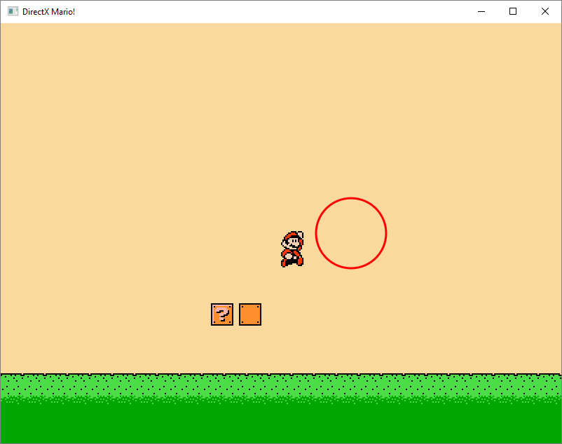

# DXMario

A game project where I tested the Direct2D library. Loading game sprites with WIC coder that comes with D2D library. It was easy to make the player animated by loading animation data and animation sprite. Then just advance to next frame every 100 ms. I found D2D to be similar to the C# WinForm drawing API. Created a test level where the player is controlling Mario. Mario can move and jump. Nothing fancy, after all this was just a test.

Tags: C++, Direct2D, Game, Sprite Animation
